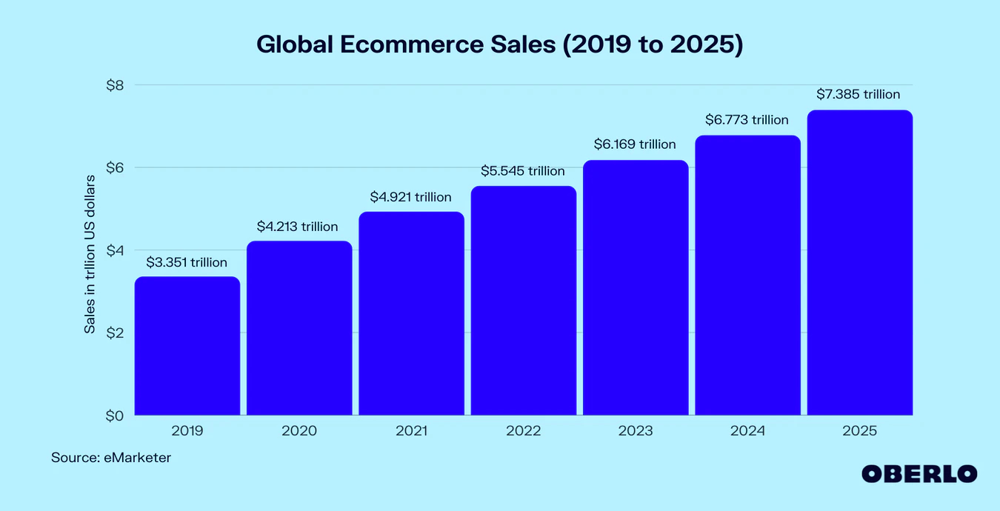
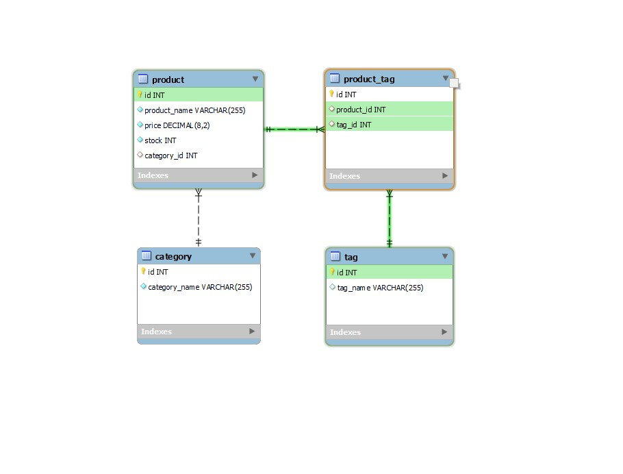
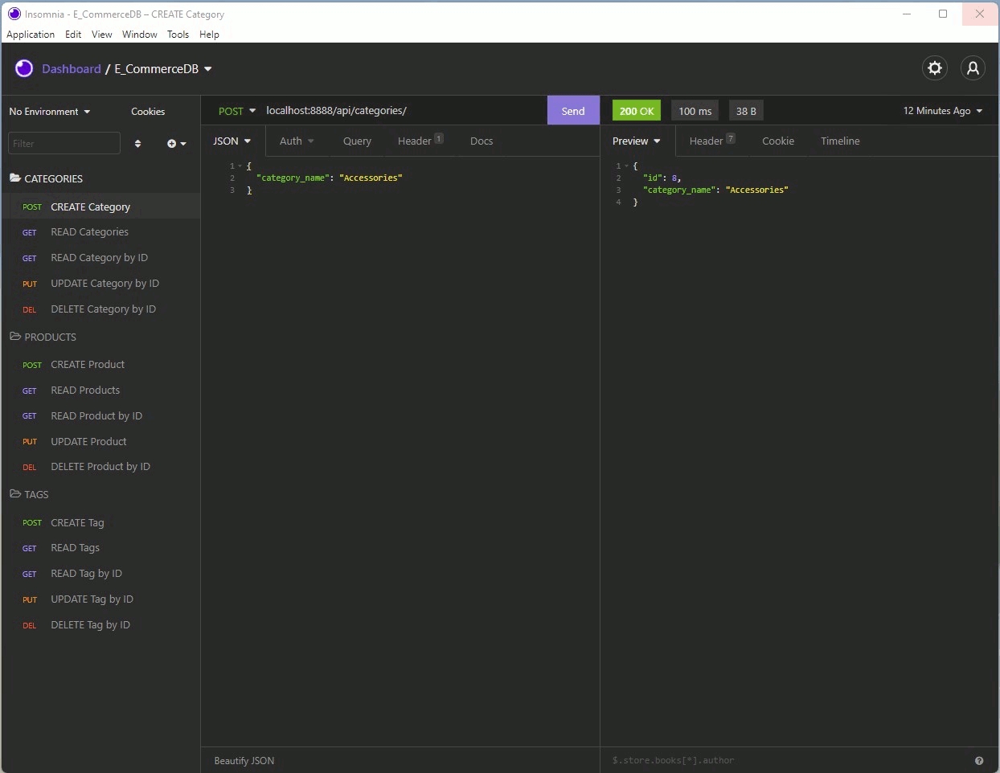
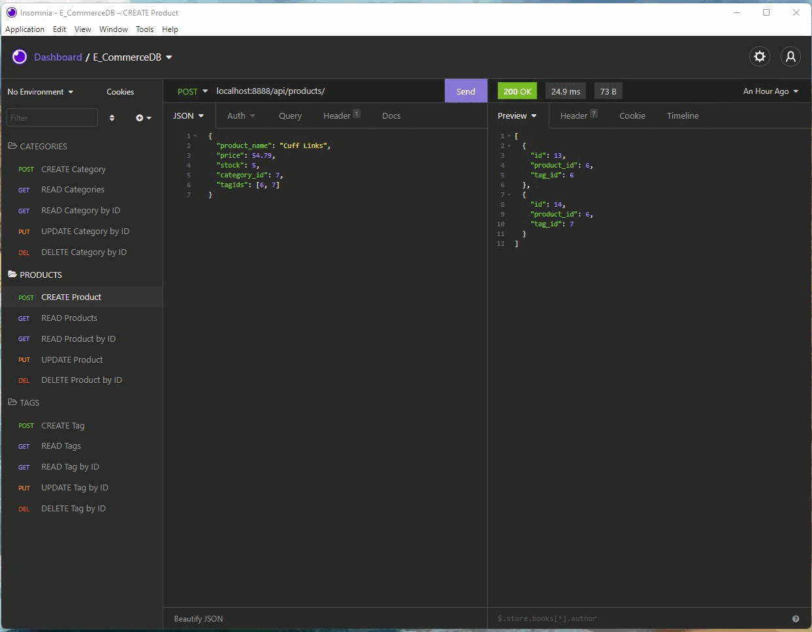
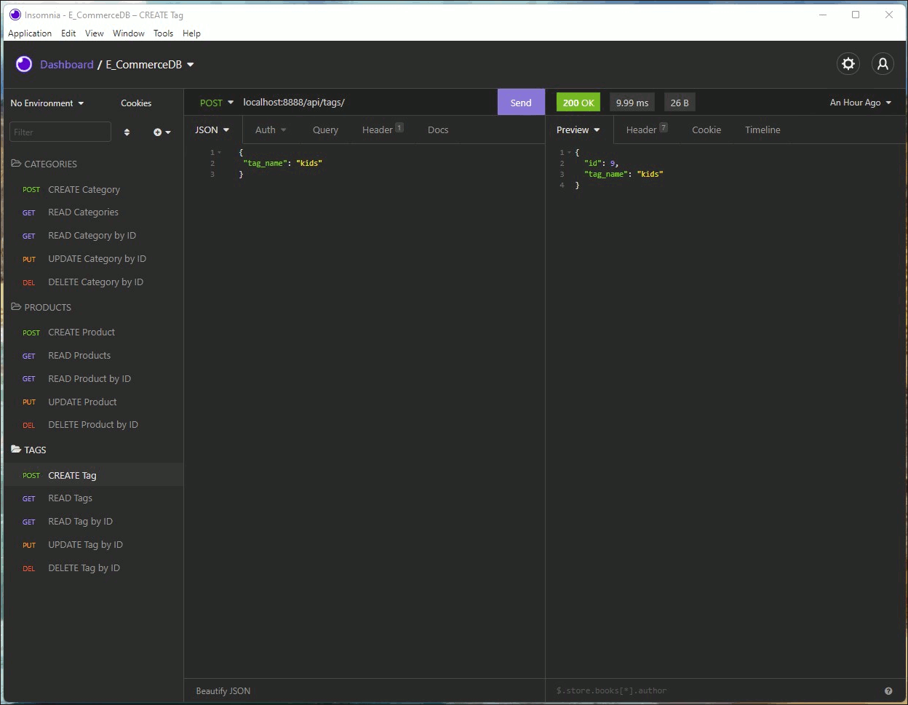

# USYD-FSF Week13 Project
## ORM: E-Commerce Back End

### Table of Contents  
  
   1. [Project Description](#1-description)
   2. [Application Features](#2-features)
   3. [Installation](#3-installation)
   4. [Usage](#4-usage)
   5. [Credits](#5-credits)
   6. [License](#6-license)
   7. [Repository Status](#7-github-repo-status)
   8. [Contribute](#8-how-to-contribute)
   9. [Tests](#9-tests)
   10. [Checklist](#10-checklist)

---
### 1. Description  
**What is this project?**  
* Server side / back end build for an e-commerce site. A working Express.js API was provided and the build uses Sequelize to interact with a MySQL database named ecommerce_db that also had seed data data provided as part of the starter code pack.

* Technologies used are MySQL2, Sequelize, MySQL database, Node.js, Express.js and dotenv.

**Why this project?**  
* E-Commerce is the largest sector of the electronics industry and continues to grow, with a forecast of US$5.55trillion in global sales in 2022:

 

This project provides the back end / server side for an e-commerce website that uses the latest technologies to enable the client's company to compete with other e-commerce companies.

**What problem does this project solve?**  
* Provides the back end / server side code using current server side technologies to create a functional and competitive ecommerce website.

**Lessons learnt?**  
* This assignment was more straight forward than others as the server side code is focused around getting the routes (linkages) right between the database and server (for this assignment) and then later the client side (front end). 
* I found it helped the process to frequently testing the routes in Insomnia as they were being created so any problems could be progressively resolved.

---
### 2. Features  
The Client provided a functional Express.js API starter code and requested:

* The database name, MySQL username, and MySQL password are added tp an environment variable file to protect secure data.
* Connects to a database using Sequelize
* A development database is created and is seeded with test data after entering schema and seed commands in the command line.
* The server is started and the Sequelize models are synced to the MySQL database after entering the command to invoke the application at the command line in the terminal.
* Opening API GET routes in Insomnia Core for categories, products, or tags has the data for each of these routes displayed in formatted JSON server responses.
* Opening API POST, PUT, and DELETE routes in Insomnia Core successfully creates, updates, and deletes data in the database.

A walkthrough video has been prepared to demonstrate the features of the application.  The video is approximately 74Mb so it might be slow to start playing from my Google Drive if you don't download it first.  
   
   [Click this link for the walkthrough video](https://drive.google.com/file/d/149Kf5HqqVHZQnSoSIU8hp3AeNJIRfyql/view?usp=sharing)  


---  
  
#### mySQL - table relationships for ecommerce_db

 

#### Category - CRUD server route sequence

 

#### Products - CRUD server route sequence

 

#### Tags - CRUD server route sequence

 


---
### 3. Installation  
You can download the source code from [my Github repository](https://github.com/Mark33Mark/E-com_server-side) and unzip the files to a location on your computer.  Once saved you will need to initialise the application and install dependencies by typing from a command line located in the directory where you saved the files:

```
npm init -y
npm install
```
Once the node.js dependencies are installed, you need to upload the database and the seed data.  Log into your my SQL and run the following commands:

```
> mysql -u YOUR USER NAME OR ROOT -p
(you will then be prompted for your password )
   source db/schema.sql
   quit
```
To seed the database:
```
npm run seed
```


Once all dependencies are installed and you have created the ecommerce_db database and seeded it with the data, you will need to amend the .env.EXAMPLE file by renaming it .env and updating the contents of the file with your mySQL username, database name and mySQL password.  

Once all of these actions are completed you need to run the server by typing:

```
node server.js
```
or, if you prefer you can run the server using the npm script:
```
npm start
```

To test the database server routes, you will need [Insomnia](https://insomnia.rest/), [Postman](https://www.postman.com/) or a similar API design platform software.

I use Insomnia, [refer pictures above](#category---crud-server-route-sequence) and have provided an export of server request's collection for you to import into Insomnia.  The file is located in the codebase and named "Insomnia_E_CommerceDB_routes".

---

### 4. Usage  
The code can be downloaded from [my Github repository](https://github.com/Mark33Mark/E-com_server-side) for all assets created for the project.  
You can modify the code as you need.

---
### 5. Credits  
There are no particular call outs for this assignment, all code was used with reference to the unit 13 Activities.

---
### 6. License  
 The works in this repository are subject to:  

[](doc/LICENSE.md)

---
### 7. Github repo status  

 
 

---
### 8. How to Contribute
 If you would like to contribute, please comply with the Contributor Covenant Code of Conduct:  

[](doc/code_of_conduct.md)

---
### 9. Tests  
- No unit tests have been prepared for this project.  Testing done on my desktop running different scenarios.  A problem exists causing the application to glitch when trying to change an employee after deleting their manager.  Needs to be resolved.

---
### 10. Checklist  
 All actions not checked are still to be completed:

 [x]  GitHub repository containing your application code.  
 [x]  Walkthrough video demonstrating the functionality of the e-commerce server routes using Insomnia or Postman is submitted with the [Walkthrough link to video](https://drive.google.com/file/d/149Kf5HqqVHZQnSoSIU8hp3AeNJIRfyql/view?usp=sharing)  
 [x]  Walkthrough video shows all of the technical acceptance criteria being met.  
 [x]  Walkthrough video demonstrates how to create the schema from the MySQL shell.  
 [x]  Walkthrough video demonstrates how to seed the database from the command line.  
 [x]  Walkthrough video demonstrates how to start the application's server.
 [x]  Walkthrough video demonstrates GET routes for all categories, all products, and all tags being tested using Insomnia or Postman.
 [x]  Walkthrough video demonstrates GET routes for a single category, a single product and a single tag using Insomnia or Postman.
 [x]  Walkthrough video demonstrates  POST, PUT and DELETE routes for categories, products and tags being tested in Insomnia or Postman.
 [x]  Application connects to a MySQL database using MySQL2 and Sequelize packages.
 [x]  Sensitive data is stored using environment variables through the use of dotenv package.  
 [x]  Application syncs Sequelize models to a MySQL database when the server starts.  
 [x]  Application includes column definitions and model associations for all four models outlined in the homework instructions.
 [x]  The GitHub repository contains all the application code.  
 [x]  Repository has a unique name; follows best practice for file structure; and naming conventions.  
 [x]  The application resembles the mock-up functionality provided in the assigment instructions.  
 [x]  Repository follows best practices for class/id naming conventions, indentation, quality comments, etc.  
 [x]  Repository contains multiple descriptive commit messages.  
 [x]  Repository contains a README file with description, screenshot and link to deployed application.  

---

- [Back to the top](#usyd-fsf-week13-project)